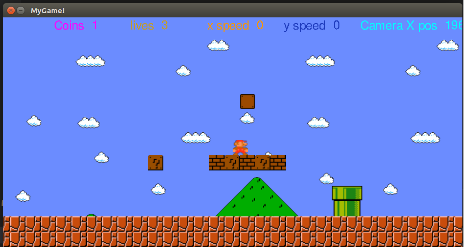

### SuperMario
Fifth Project of Advanced Programming Course Spring98  

### Description

AP project which is implementation of first level of super mario with basic object oriented and SDL(RSDL) framework 
More details are available in Assignment5.pdf   

### Running

make
./a.out [Address of map level]

or using runner.sh script

